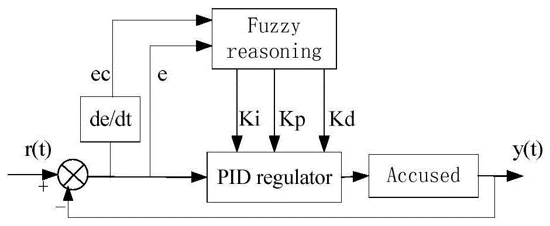
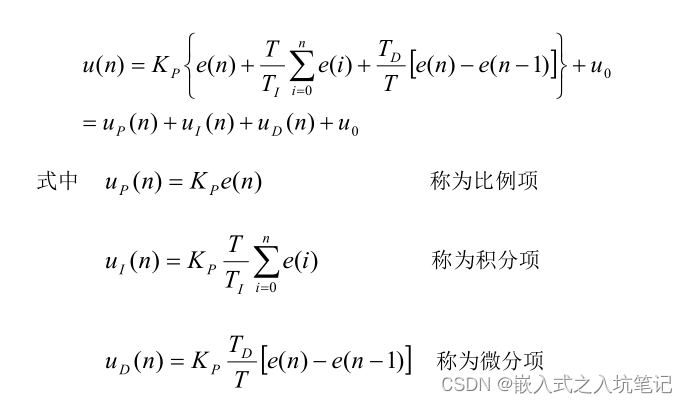
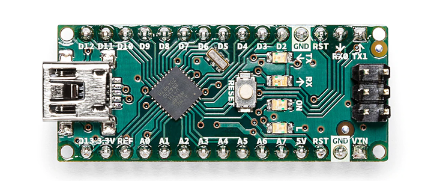

# PID Line Following Algorithm for Arduino-based Car

When designing an Arduino-based car, the PID (Proportional-Integral-Derivative) line following algorithm is an effective control method that ensures the car travels steadily along a predefined path. Here's a brief overview of this algorithm:

## PID Algorithm Overview
The PID controller relies on three main parameters: Proportional (P), Integral (I), and Derivative (D). These parameters are adjusted to precisely guide the car based on sensor-detected track positions:

**Proportional (P)**: Adjusts the control output based on the current error, allowing the car to approach the center of the track more rapidly.

**Integral (I)**: Corrects long-term deviations by accumulating historical errors, ensuring the system maintains stability over extended periods.

**Derivative (D)**: Predicts error rate changes to prevent overshooting or oscillations, achieving smooth track tracking.

## Arduino Introduction
Arduino is an open-source electronics prototyping platform that provides accessible hardware and software tools for creating interactive projects. Its components include:

Development Boards: Mainboards based on microcontrollers like Arduino UNO, Arduino Mega, etc.

Integrated Development Environment (IDE): Software tool used for writing and uploading code to Arduino boards.

Library Functions: Pre-built function libraries that simplify control from sensors to actuators.

## Conclusion
The PID line following algorithm harnesses the flexibility and user-friendliness of Arduino, making the design and debugging of Arduino-based cars efficient and effective. By fine-tuning PID parameters, stable navigation along complex tracks can be achieved, empowering robotics control and automation projects.

This approach not only offers theoretical advantages but also practical applications that leverage Arduino's dynamics effectively.
